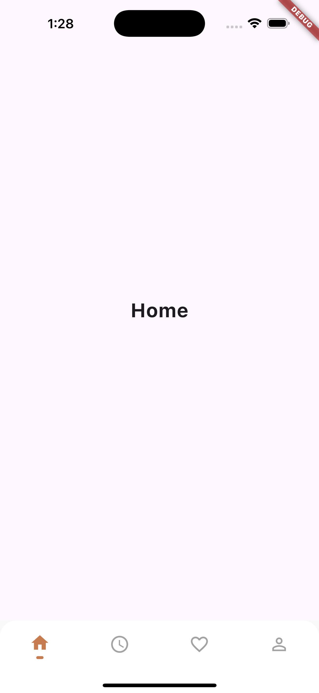

# 📱 Flutter Custom Bottom Navigation Bar

A clean and modern **Custom Bottom Navigation Bar** implementation in Flutter. This project demonstrates how to build a **responsive, stateful, icon-swapping bottom nav bar** with dynamic selection highlighting using **Responsive Sizer** for adaptive layouts.

---

## ✨ Features

- 🔥 **Custom Icon Swap on Selection**
- 🎨 **Modern, Clean UI**
- 📏 **Responsive Layout with `responsive_sizer`**
- ⚙️ **Simple State Management**
- 💾 **Expandable & Modular Code Structure**
- 📱 Perfect for small apps, dashboards, or concept UIs

---

## 📸 Preview



---

## 📦 Dependencies

```yaml
dependencies:
  flutter:
    sdk: flutter
  responsive_sizer: ^3.2.0
```

---

## 📂 Project Structure

```
lib/
├── bottom_nav.dart        # Custom Bottom Navigation widget
├── constants.dart         # Constants for icons and labels
├── history_screen.dart    # Sample Page: History
├── home_screen.dart       # Sample Page: Home
├── main.dart              # App Entry Point
├── main_screen.dart       # Scaffold managing page navigation and bottom nav
├── profile_screen.dart    # Sample Page: Profile
└── wishlist_screen.dart   # Sample Page: Wishlist
```

---

## 🚀 Getting Started

### 1️⃣ Clone the Repo

```bash
git clone https://github.com/rate-code/flutter-custom-bottom-nav.git
cd flutter_custom_bottom_nav
```

### 2️⃣ Install Dependencies

```bash
flutter pub get
```

### 3️⃣ Run the Project

```bash
flutter run
```

---

## 🛠️ Customization

- Add more icons and pages via `BottomMenuItem` list in `constants.dart`.
- Update navigation icons by setting `icon` and `selectedIcon`.
- Easily replace the page content by swapping widgets in the `pages` list inside `MainScreen`.

---

## 📚 Tutorials & Docs

📺 [Watch the Full Video Here](https://youtu.be/aQGs2tAY9co)

---

## 💌 Contact & Credits

👨‍💻 Created by **Rate Code**  
📧 [rate.code.115@gmail.com](mailto:rate.code.115@gmail.com)

---

**⭐️ Don’t forget to star the repo if you found it helpful!**
